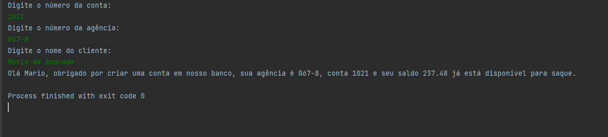
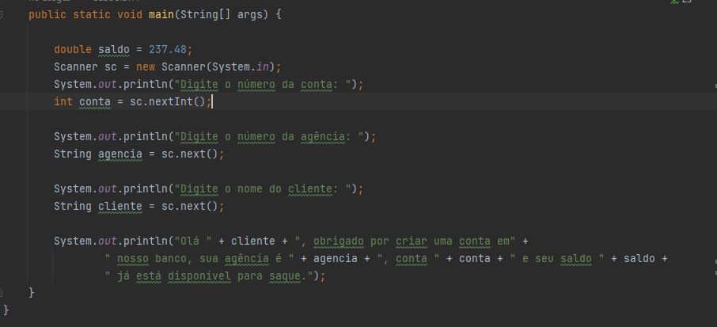

## Desafio Conta Banco - Java DIO

O desafio consiste em criar uma classe que irá receber dados de um cliente através do terminal e imprimir estes dados 
no console. 

### Requisitos do desafio
* Criar um projeto chamado ContaBanco.
* Criar uma classe chamada ContaTerminal.
* Utilizar a classe Scanner para ler dados do console.

A classe deverá ter os seguintes atributos:

| Atributo | Tipo | Exemplo |
| -------- | ---- | ------- |
| Numero | Inteiro | 1021 |
| Agencia | Texto | 067-8 |
| Nome Cliente | Texto | Mario de Andrade|
| Saldo | Decimal | 237.48 |

### Retorno no console
Para finalizar, a classe deverá retornar uma mensagem no console com a seguinte frase:

"Olá Mario, obrigado por criar uma conta em nosso banco, sua agência é 067-8, conta 1021 e seu saldo 237.48 
já está disponível para saque."

Abaixo vemos a entrada dos dados no terminal e a mensagem para o cliente.

Abaixo temos a construção da classe ContaTerminal.java

